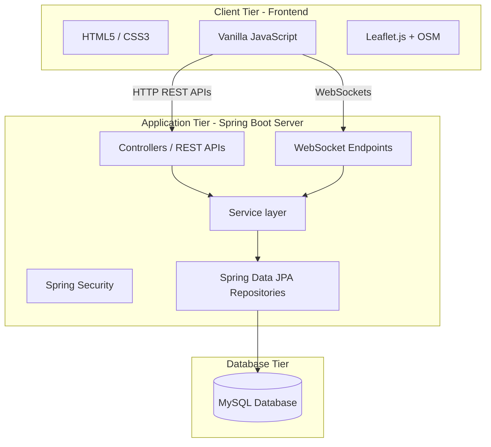

# SmartBus Project Architecture

This document describes the high-level architecture of the **SmartBus – Intelligent Bus Ticket Reservation and Live Tracking System**.

## Architectural Overview
SmartBus is a web application with a decoupled architecture separating the frontend client and the backend server.

## Client Layer (Frontend)
- **Technology Stack**: HTML5, CSS3, Vanilla JavaScript.
- **Routing**: Client-side directory mapping and standard hyperlinks.
- **Maps & Live Tracking**: Leaflet.js integrating OpenStreetMap (OSM) for viewing live bus location updates sent over WebSockets.

## Server Layer (Backend)
- **Technology Stack**: Java, Spring Boot, Spring Security, Spring Data JPA, Hibernate, WebSocket.
- **REST API**: Provides JSON endpoints for user authentication, bus search, schedules, reservations, and driver trip logs.
- **WebSocket Broker**: Manages real-time location streaming from drivers to passengers.

## Persistence Layer
- **Technology Stack**: MySQL database mapped through Spring Data JPA and Hibernate.
